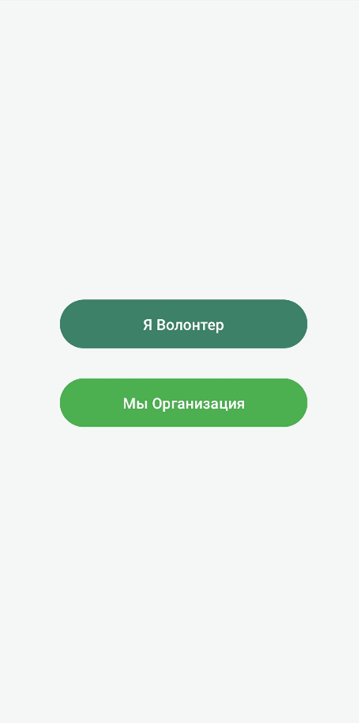
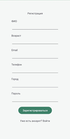
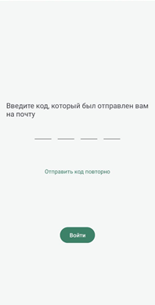
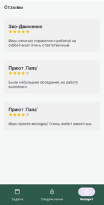
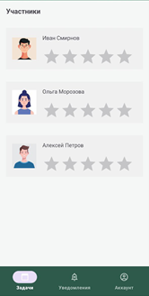
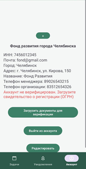
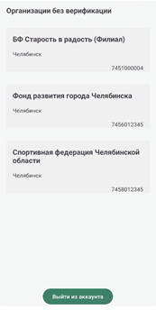
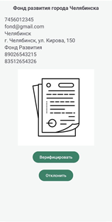

# MicroVolunteer – Приложение для микроволонтерства

Мобильное приложение на Android, автоматизирующее поиск и выполнение коротких волонтёрских задач. Связывает проверенные НКО с добровольцами, позволяя помогать «здесь и сейчас» без долгосрочных обязательств.

## Экраны приложения

### Авторизация и регистрация
| Экран | Описание |
|-------|----------|
|  | **Выбор роли** – выбор роли (Волонтёр / Организация). |
|  | **Регистрация** – Регистрация для волонтеров. |
|  | **Верификация email** – ввод 6-значного кода, который был отправлен на почту. Без подтверждения доступ к функциям ограничен. |

### Интерфейс волонтёра
| Экран | Описание |
|-------|----------|
|  | **Лента задач** – отображение активных задач. Оптимизировано через `DiffUtil` + `RecyclerView`. |
|  | **Поиск и фильтры** – клиентская фильтрация по категории, городу, дате. Обновление в реальном времени. |
|  | **Отзывы** – `RatingBar` + комментарий после завершения задачи. Формирует рейтинг волонтёра. |

### Интерфейс организации
| Экран | Описание |
|-------|----------|
|  | **Список кандидатов для оставления отзывов** – Принятые волонтеры, которым необходимо оставить отзыв. |
|  | **Статус НКО** – предупреждение для проверки документов. Кнопка создания задачи скрыта. |

### Админ-панель
| Экран | Описание |
|-------|----------|
|  | **Очередь модерации** – список организаций, ожидающих проверки. |
|  | **Верификация** – детальный просмотр сканов документов. Кнопки «Верифицировать» / «Отклонить». |

## Стек технологий
- **Язык:** Kotlin
- **Архитектура:** Clean Architecture + MVVM
- **Сеть:** Retrofit + OkHttp + Coroutines
- **UI:** XML, ViewBinding, Navigation Component, `DiffUtil`, Coil
- **DI:** Hilt
- **Уведомления:** Firebase Cloud Messaging (FCM)
- **Сервер:** REST API + PostgreSQL

## Архитектура
Проект разделён на три независимых слоя:
- **Presentation:** `Fragment`/`Activity`, `ViewModel`, `SharedFlow`/`StateFlow`
- **Domain:** `UseCases`, доменные модели, интерфейсы репозиториев
- **Data:** `Retrofit`, `SharedPreferences`, DTO, мапперы, интерсепторы (`AuthInterceptor`, `ErrorInterceptor`)
